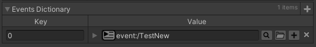

# Unofficial Odin support for FMOD

## Basic

Simple workaround to make FMOD fields and attributes correctly detect and save changesm, for example in dictionary. Simple and **FMOD update**-proof

### How to install

Put `OdinFMODSupport.cs`, from Basic folder, into `Editor` folder in Unity project.

## OdinFMOD

Recreation of FMOD property and attribute drawers in Odin Inspector. Also added validator for `EventReference` class.

:warning: As it is a recreation, it can break after a FMOD update

## Comparison

Correctly handles drawing without label, for example in dictionary

### How to install

Put `OdinFMOD` folder into `Editor` folder in Unity project.
